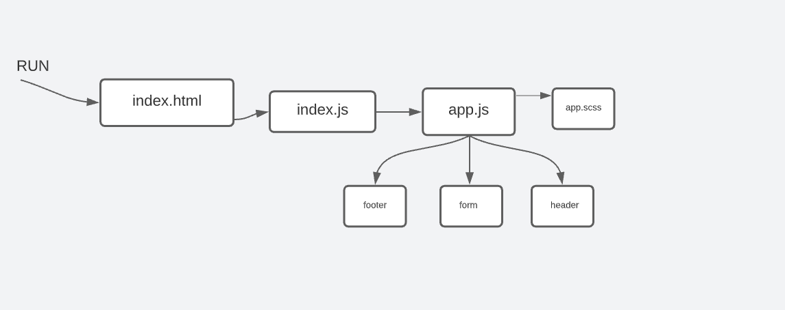

# resty ✨

# Create React App

- RESTy Phase 1: Begin work on the RESTy API testing application

## Requirements

> Today, we begin the first of a 4-Phase build of the RESTy application, written in React. In this first phase, our goal is to setup the basic scaffolding of the application, with intent being to add more functionality to the system as we go. This initial build sets up the file structure so that we can progressively build this application in a scalable manner

 

## UML diagram :

 

### npm start

> npm start  
> Runs the app in the >>>> http://localhost:3000

 

## Deployment on sandbox : 👇

- https://codesandbox.io/s/modest-kirch-k5s70

## The code : 👇

- https://github.com/mr-atta/resty
